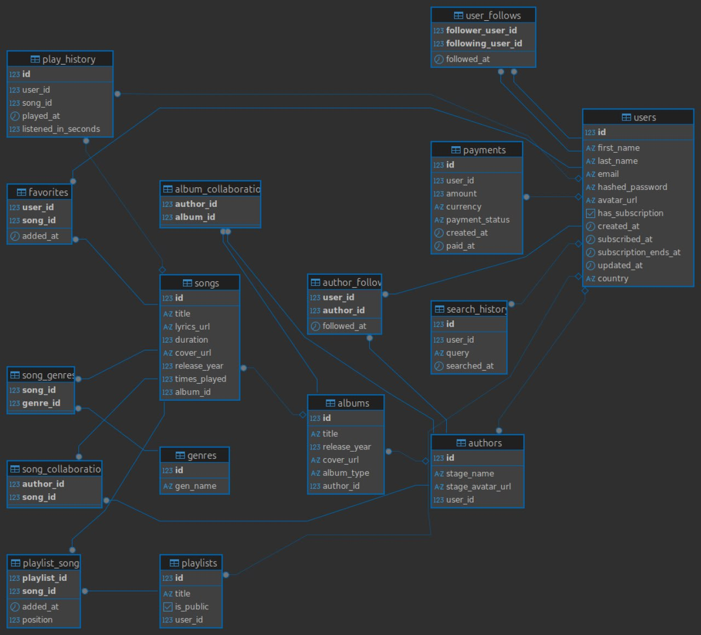

# База данных для музыкального сервиса
#
Использованный язык: SQL
Количество таблиц: 16
Файлы:
 - music_db.sql - содержит схему базы данных.
 - data_for_db.sql - содержит данные для заполнения базы данных.
 - queries.sql - содержит запросы и процедуры для бд.
# UML-диаграмма:

#
#Краткое описание таблиц:
- users - содержит информацию о пользователях
- authors - содержит информацию об исполнителях(задумка такова, что любой пользователь может быть исполнителем)
- album_collaborations - коллаборации по альбомам(у одного альбома может быть несколько авторов). Таблица является связующим звеном между альбомом и автором.
- songs - содержит информацию о треках
- song_collaborations - коллаборации песен(у одной песни может быть несколько авторов).Таблица является связующим звеном между песней и автором.
- genres - таблица содержит названия различных жанров
- song_genres - в таблице содержится связь жанров и песен. У одной песни может быть несколько жанров.
- playlists - содержит название плэйлиста, статус плэйлиста(public(TRUE)/private(FALSE)),id автора, которому принадлежит плэйлист. Таблица служит связующим звеном между плэйлистом и автором.
- favorites -избранные или лайкнутые пользователем песни. Таблица выступает связующим звеном между понравившейся песней и пользователем.
- playlist_songs - содержит id песни,позицию песни в плэйлисте и id плэйлиста, в который была добавлена песня. Таблица отображает связь между песней и плэйлистом.
- play_history - история прослушиваний пользователя. Содержит id песни, id пользователя, который прослушал эту песню, время, в которое песня была прослушана, и сколько именно времени заняло прослушивание в секундах.
- user_follows - подписки на пользователей. Содержит id подписавшегося пользователя и id пользователя, на которого подписались, а также дату и время,в которое подписались.(по задумке, можно подписываться на пользователей, плэйлисты которых вам нравятся)
- author_follows - подписки на исполнителей. Содержит id подписавшегося пользователя и id исполнителя, а также дату и время,в которое подписались.
- payments - история платежей. В музыкальном сервисе есть возможность купить подписку. Эта таблица отражает историю платежей пользователей, купивших подписку. Содержит id пользователя, купившего подписку, валюту, в которой осуществляется оплата, сумма, которую заплатили,статус платежа(completed/failed), время, в которое была попытка совершить платёж, и время, в которое подписка была оплачена.
-search_history - история поиска пользователей. Содержит id пользователя, текстовый запрос и время, в которое запрос был сделан.